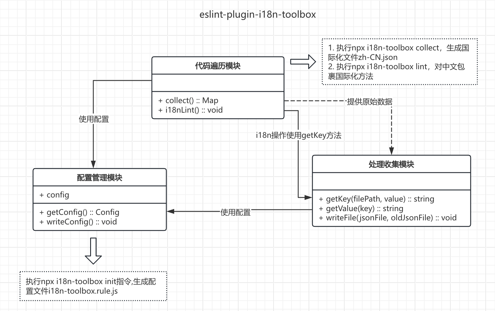
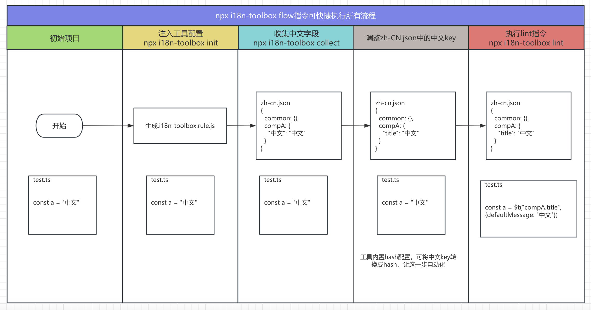

## 1. 国际化改造概述

国际化(i18n)是将软件适应不同语言和地区的过程，具体到代码即是给代码中的`中文`包裹国际化方法`$t('key.title', {/* defaultMessage: '中文' */})`，国际化方法提供了多语言转换的能力。

但是给中文包裹国际化方法的过程，仍需要**人工实现**，对旧项目改造而言，这部分工作量巨大，针对此问题，这里基于 ESLint 插件实现了国际化工具，提供项目国际化全流程支持：

1. 自动收集代码中的中文词条
2. 生成国际化配置文件
3. 自动替换中文为国际化方法调用
4. 若不想自动替换，也可以作为 eslint 工具提示代码中未转换的中文字段

## 2. 传统国际化改造流程

### 2.1 改造前的项目结构

假设存在这样一个待改造的国际化项目：

```txt
project
└── src
│   └── A.tsx
```

`A.tsx`

```tsx
const A = () => {
  return <div>中文</div>;
};
```

### 2.2 手动改造步骤

1. 创建语言文件

2. 提取中文文本，设置中文文本对应的 key

3. 引入国际化函数，替换中文文本
   - 业务代码根据不同场景，进行对应的国际化改造
     - `test.ts`

     ```ts
     import { t } from "@/locales";
     // 普通方法直接引入国际化方法
     const func = () => {
       return t("test");
     };
     ```

     - `A.tsx`

     ```tsx
     import { useLocales } from "@/locales";
     // 组件的国际化需要响应式，因此先引入钩子，使用钩子生成的国际化方法
     const A = () => {
       const { t } = useLocales();
       return <div>{t("title")}</div>;
     };
     ```

### 2.3 改造后的项目结构

```txt
project
└── src
│   ├── locales
│   │   │   └── lang
│   │   │   │   ├── zh-CN.json
│   │   │   │   └── en-US.json
│   │   └── index.ts
│   └── A.tsx
```

`zh-CN`

```json
{
  "title": "中文"
}
```

`A.tsx`

```tsx
import { useLocales } from "@/locales";
const A = () => {
  const { t } = useLocales();
  return <div>{t("title")}</div>;
};
```

## 3. 国际化改造工具

为了简化上述手动过程,我们开发了一个基于 ESLint 插件的自动化工具。

### 3.1 工具工作流程

1. 遍历文件，收集中文字段，生成原始的 json 文件
2. 对 json 文件的中文 key 进行处理，将其转换成有意义的非中文 key
3. 再次遍历文件，将中文字段根据对应场景，进行包裹对应的国际化方法

### 3.2 工具架构



工具由三个模块构成：

1. 代码遍历模块，包含两部分功能：中文收集、中文包裹国际化方法
   - 中文收集：收集 key 为文件路径，value 为文件中中文键值对的对象

     ```js
     // 收集的数据结构
     {
       "src/pages/portal/index.ts": {
         "中文": "中文"
       }
     }
     ```

   - 中文包裹国际化方法：根据中文所在场景，选择合适的国际化方法（如上面在普通方法和组件中引入国际化方法）

2. 收集处理模块
   - 步骤 1 收集的 json 文件不能直接作为国际化文件写入，该模块负责根据**用户配置**，生成对应层级结构的 zh-CN 文件

     ```js
     // 收集的数据结构转换成层级结构
     {
       "src": {
         "pages": {
           "portal": {
             "title": "中文"
           }
         }
       }
     }
     ...
     // 也可以拆分不同的文件夹，生成如下结构
     {
       "src": {
         "pages": require("./pages")
       }
     }
     ```

   - 当我们将国际化文件转换成需要的数据结构（如上面的例子 ⬆️）后，根据上述结构对中文包裹国际化方法时，该模块也会负责处理中文和 key 之间的关系

     ```txt
     // 该模块会解析用户配置，从而得到中文字段对应的key
     "中文" -> t("src.pages.portal.title")
     ```

3. 配置管理模块
   - 代码遍历和收集处理模块都涉及一些用户配置，该模块负责用户配置的管理

## 4. 工具的使用

工具基于 eslint 插件机制开发，以便于开发时的提测与集成。

### 4.1 安装

1. 下载工具 [`eslint-plugin-i18n-toolbox`]():

```sh
npm install eslint-plugin-i18n-toolbox --save-dev
```

2. eslintrc 添加配置：

```js
module.exports = {
  plugins: ["i18n-toolbox"],
  rules: {
    "i18n-toolbox/no-chinese-character": [
      "error",
      {
        // 具体配置见后面配置详解
      },
    ],
  },
  /*
   * 视情况可以让工具在某些文件不生效
   * 参考eslint.overrides: https://eslint.org/docs/latest/use/configure/configuration-files-deprecated#how-do-overrides-work
   */
  overrides: [
    {
      files: [],
      rules: {
        "i18n-toolbox/no-chinese-character": "off",
      },
    },
  ],
};
```

3. 注入工具配置文件

```js
npx i18n-toolbox init
```

4. 一些尝试：可以试着执行 flow 指令看看效果

```js
npx i18n-toolbox flow
```

### 4.2 快捷指令

指令示例`npx i18n-toolbox xxx`

| 指令名    | 说明                                   |
| --------- | -------------------------------------- |
| `init`    | 注入默认的`i18n-toolbox.config.js`配置 |
| `collect` | 收集代码中的中文字段，生成国际化文件   |
| `lint`    | 修改代码，给中文包裹国际化方法         |
| `flow`    | 自动执行`init->collect->lint`          |

### 4.3 使用效果



### 4.4 配置

前面提到工具由三个主要部分构成

1. 代码遍历模块（基于 eslint 插件）
2. 处理收集模块
3. 配置管理模块

代码遍历模块基于 eslint 插件实现，因此配置也分为两部分：

1. eslint 配置，配置【代码遍历模块】lint fix 功能的逻辑
2. I18n-toolbox.rule.js，配置【代码遍历模块】收集，以及【处理收集】模块的功能逻辑

这些配置统一由【配置管理】模块处理并提供给其他模块

#### 4.4.1 eslint 配置

和普通 eslint 插件规则类似，`.eslintrc.js`文件模板如下：

```js
module.exports = {
  plugins: ["i18n-toolbox"],
  rules: {
    "i18n-toolbox/no-chinese-character": [
      "error",
      {
        silence: false, // 当设为true时，某个文件lint报错会直接跳过，而不阻塞lint过程，如果要调试就设为false
        ignoreConsole: true, // console.log中的中文不处理也不收集
        autoFillKey: true, // 不传或传false时，中文->$t("", {defaultMessage: "中文"}),key不会自动填充
        strictMode: false, // 为true时，严格遵守source配置，在组件中只能用钩子生成的t方法，用普通的$t方法会强制修复
        defaultMessage: "defaultMessage", // $t("", {[key]: "中文"})中对应的key值
        /**
         * 对于模板字符串：`中文${key}结尾`
         * 转换的defaultMessage: '中文{value1}结尾'
         * 有时候可能会希望转换的defaultMessage中为'中文{{value}1}结尾'结构，将prefix设为'{{'，suffix设为'}}'
         */
        templateLiteralExpression: {
          prefix: "{",
          suffix: "}",
        },
        // 自动注释：中文->$t("", {/* defaultMessage: "中文" */})，即使不开启也能根据注释找key
        commentDefaultMessage: false,
        // 如果commentDefaultMessage为false,revertCommentDefaultMessage为true，会自动消除defaultMessage的注释状态
        revertCommentDefaultMessage: false,
        // 描述如何导入国际化方法
        source: {
          component: [
            // 这里结合下一条的name，组成import {useLocale} from "@/locale/hooks"
            {
              type: "import",
              specifier: "object", // object/default/namespace
              name: "@/locale/hooks",
            },
            // 结合下一条的name,组成 const {t} = useLocale()
            {
              type: "hook",
              specifier: "object", // object/default/namespace
              name: "useLocale",
            },
            {
              type: "locale",
              name: "t",
            },
          ],
          // template: [], //vue template导入配置，不传就使用component配置
          // vueComponent: [], // vue component配置，不传就使用component配置
          default: [
            {
              type: "import",
              specifier: "object", // object/default/namespace
              name: "@/locale/utils",
            },
            {
              type: "locale",
              name: "$t",
            },
          ],
        },
      },
    ],
  },
};
```

需要注意的是`source`配置，用于描述给中文包裹国际化方法时，如何引入，以上面的`souce`配置为例，针对组件中的中文：

```jsx
const A = () => {
  return <div>中文</div>;
};
const a = "中文";

// fix后
import { useLocale } from "@/locale/hooks";
import { $t } from "@/locale/utils";
const A = () => {
  const { t } = useLocale();
  return (
    <div>
      {t("title", {
        /* defaultMessage: "中文" */
      })}
    </div>
  );
};
const a = $t("title", {
  /* defaultMessage: "中文" */
});
```

可以单独配置 vue 的 template、vue 组件内容的国际化方法 source 配置（分别对应 template 和 vueComponent），若没设置，则默认使用 component 配置；假设 component 配置也没设置，统一使用 default 配置

若在 vue2 中使用，由于 vue2 中往往会将国际化方法$t 挂载在 this 对象上，因此 source 可以按照如下方式配置

```js
{
      source: {
       // template中，不需要带this前缀
        template: [{
          type: "locale",
          name: "$t"
        }],
        component: [{
           type: "locale",
           name: "this.$t"
        }],
        default: [{
           type: "import",
           name: "@/locales"
        }, {
          type: "locale",
          name: "$t"
       }]
      }
}
```

#### 4.4.2 `i18n-toolbox.config.js`配置

执行**`npx i18n-toolbox init`**指令,在项目中注入`i18n-toolbox.config.js`文件，配置如下：

```typescript
interface SplitConfig {
  writeToFile?: boolean; // 当前文件是否单独写入本地
  splitWriteToFile?: boolean; // split的项是否写入本地
  split?:
    | {
        [key: string]: SplitConfig;
      }
    | boolean;
}

interface I18nToolboxConfig {
  eslintrc?: string | string[]; // 项目eslintrc文件的位置，默认./eslintrc
  // 收集数据的路径，lint指令也借用了该配置
  collect: {
		// 入口路径，例如./src，如果customSuffix不为true，默认识别./src/**/*.{vue,ts,js,tsx}
    // 如果customSuffix为true，用户需要自己配置后缀，input:['./src/**/*.{vue,tsx}', ./dir/**/*.{ts,js}]
    input: string | string[];
    customSuffix?: boolean;
  };
	// 收集的国际化词条写入的过程
  locale: Omit<SplitConfig, "writeToFile"> & {
    // 生成json对象，root为生成json对应的根目录
    root: string;
    // 国际化文件写入目录
    output: string;
    // 如果一个中文字段重复minTimes（默认值2）次，就将它放入key为keyName（默认'common'）配置的对象中
    // common设为false则不会生成common对象
    common?: boolean | {
      keyName?: string;
      minTimes?: number;
			/**
			* 可以设置哪些文件夹中的中文不计入common中
 			* type ValidateFilePathTuple = string | RegExp | ((filePath: string) => boolean);
 			* type ValidateFilePath = ValidateFilePathTuple | ValidateFilePathTuple[];
 			*/
      ignorePath?: ValidateFilePath;
    };
    // 如果zh-CN对象不分层级，设为false即可,具体拆分逻辑见后面split详解
    split?: SplitConfig|boolean
    // 默认为'-'，部分文件命名时，会用pages.xxx这种结构，而i18n的key也是用.作为连接符,容易产生歧义，因此在转换时需要将文件名为pages.xxx的项，转换成pages-xxx的结构，也可以传一个方法进行替换
    splitKeyReplacer?: string | (key: string)=> string
    // 自定义拆分组，filePath为原文件路径，return的path为在zh-CN中目录的路径，writeToFile控制是否单独写入为一个文件
    splitGroups?: [
      // (filePath) => {
      //   if(filePath.includes('src/portal/pages/home')) {
      //     return {
      //       path: 'testaaaaaaaaa.xxx',
      //       writeToFile: true,
      //     }
      //   }
      // }
    ]
     // collect会生成{[key: 文件路径]: {'中文': '中文'}}的对象结构，通过writeLocaleFile转换成写入的zh-CN对象，如果不想用默认的转换方法，可以自定义writeLocaleFile进行覆盖
    writeLocaleFile?: WriteLocaleFile;
    // 内置的writeLocaleFile方法参数为(本地文件内容，收集的文件内容)，override设为true，每次强制使用收集的内容覆盖本地
    override?: boolean;
    // （文件路径, 中文）=> 国际化key
    getLocaleKey?: GetLocaleKey;
    // （zh-CN中的JSON对象, 国际化key）=> 国际化key
    getLocaleValue?: GetLocaleValue;
    /**getFile时的最小时间间隔 */
    poll: number;
    // 直接将中文转换成hashKey位的hash
    hashKey?: number | boolean; // 默认值: 8
  };
}
```

`split`拆分逻辑如下

```
// 用于将国际化对象拆分到多目录写入，例如这个配置
{
  collect: {
    input: './src',
  },
  locale: {
    // src目录下一层需要进行拆分
    split: {
      // src/portal目录需要进一步细化拆分
      portal: {
        writeToFile: true, // 拆分的portal部分是否单独写入一个文件
        split: {
          pages: {
            splitWriteToFile: true, // 拆分的子项是否都单独写入一个文件
            // src/portal/pages目录下的每个页面都需要单独拆分,拆分到下一级终止
            split: true,
          },
        },
      },
    },
  },
}
```

配置的划分与工具的模块相对应:

- collect 配置对应【代码遍历模块】的 collect 行为，lint fix 行为由 eslint 配置控制

```js
interface I18nToolboxConfig {

  collect: {
    ......
  };

}
```

- locale 配置对应处理收集模块的操作

```js
interface I18nToolboxConfig {
  locale: {
    ......
  };
}
```
